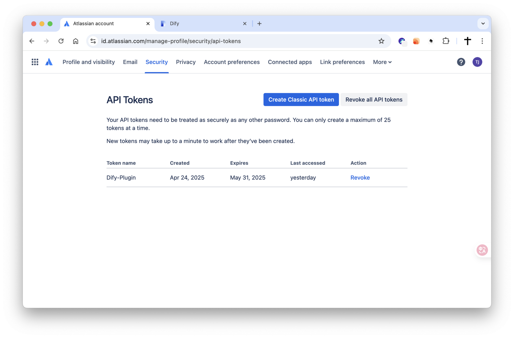
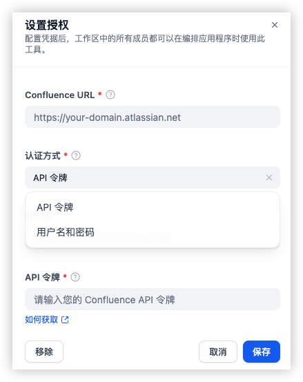
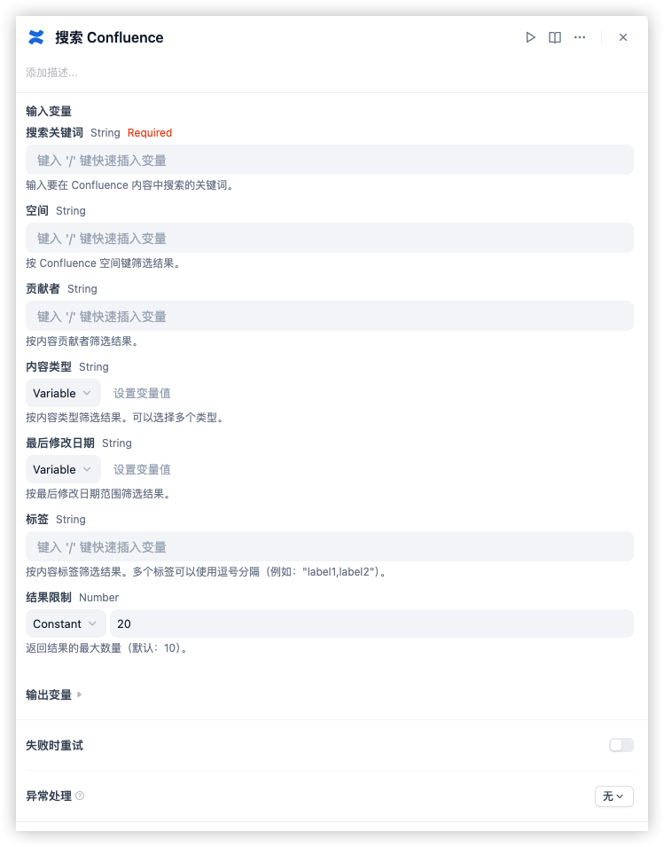

# Dify Plugin for Confluence (扩展版)

## 描述

这个Dify插件是基于[官方Confluence插件](https://github.com/langgenius/dify-official-plugins/tree/main/tools/confluence)的功能扩展版本，允许您与Confluence实例交互，执行各种操作如管理空间和页面。该插件设计用于与Confluence的特性和功能无缝集成，并提供了额外的认证选项和搜索功能。

## 功能扩展

相比原始版本，本扩展版本增加了以下功能：

1. **增强的认证方式**：
   * 新增支持API令牌认证
   * 用户名/密码认证方式（原始方式）

2. **强大的搜索功能**：
   * 使用CQL（Confluence查询语言）语法搜索内容
   * 支持按关键词、空间、贡献者等条件筛选

## 工具列表

本插件提供以下功能：

* **空间管理：**
  * 列出可访问的空间 (`list_space`)
  * 获取特定空间的详细信息 (`get_space`)
* **页面管理：**
  * 列出空间内的页面 (`list_page_of_space`)
  * 获取特定页面的内容和详细信息 (`get_page`)
  * 创建新页面 (`create_page`)
  * 删除页面 (`remove_page`)
* **搜索：**
  * 使用CQL语法搜索Confluence内容 (`search`)

## 设置指南

### 1. 获取Atlassian API令牌（使用令牌认证方式）

* 导航到您的Atlassian账户设置：[https://id.atlassian.com/manage-profile/security/api-tokens](https://id.atlassian.com/manage-profile/security/api-tokens)
* 点击"创建API令牌"
* 为您的令牌提供一个描述性标签（例如，"Dify Confluence插件"）
* 立即复制生成的API令牌。您将无法再次查看它。

### 2. 配置插件

在Dify中添加Confluence插件时，您将被要求提供：

* **认证方式**：选择"API令牌"或"用户名/密码"
* **Confluence URL**：您的Confluence实例URL（例如，`https://your-domain.atlassian.net/`）
* **用户名**：您的Confluence账户用户名（通常是您的电子邮件地址）
* **API令牌/密码**：根据选择的认证方式，输入您创建的API令牌或账户密码

输入这些详细信息以验证插件。

### 3. 使用搜索功能

搜索功能允许您使用关键词或高级CQL语法搜索Confluence内容：

* **基本搜索**：提供关键词即可搜索全站内容
* **高级筛选**：
  * 按空间筛选：限制在特定空间内搜索
  * 按贡献者筛选：查找特定用户创建或编辑的内容
  * 按标签筛选：搜索带有特定标签的内容
  * 按内容类型筛选：限制搜索特定类型的内容（如页面、博客等）

  

## 隐私政策

查看[隐私政策](PRIVACY.md)了解更多关于我们如何处理您的数据的信息。
